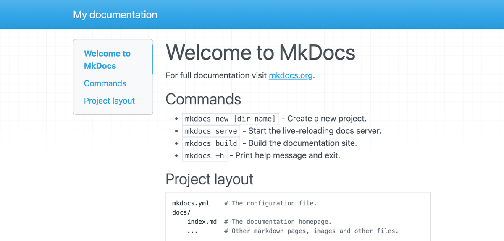

# 3. Build your first site

Time for the satisfying part. Two commands and you have a working website on
your screen.

Make sure your terminal is inside the `my-docs` folder and that `(.venv)`
appears at the start of the prompt. If not, go back to
[install the tools](install.md), steps 4 and 5.

## Create the project

```bash
mkdocs new .
```

The dot means "here, in the folder I am already in".

MkDocs prints two lines and creates three things:

```text
my-docs/
├── docs/
│   └── index.md        <- your home page
└── mkdocs.yml          <- your settings
```

That is a complete MkDocs project. Two files.

## See it in your browser

```bash
mkdocs serve
```

The terminal prints something like:

```text
INFO    -  Building documentation...
INFO    -  Documentation built in 0.15 seconds
INFO    -  [12:00:00] Serving on http://127.0.0.1:8000/
```

Open [http://127.0.0.1:8000](http://127.0.0.1:8000) in your browser. Your
website is there.



That is what you should see: the placeholder content MkDocs writes for you, in
its plain default theme. It looks nothing like this tutorial yet, and that is
expected. The theme arrives in [step 6](theme.md).

!!! info "What that address means"
    `127.0.0.1` is your own computer talking to itself. The site is running
    only for you, on your machine. Nobody else can reach it, and it disappears
    when you stop the command. Putting it online is
    [step 8](publish.md).

## Watch it update itself

Leave `mkdocs serve` running and open `docs/index.md` in any text editor.
Notepad, TextEdit, VS Code, anything.

Change the first line to something of your own:

```markdown title="docs/index.md"
# My project documentation

Welcome. This site explains how everything works.
```

Save the file and look at your browser. It has already refreshed. No reload
needed, no rebuild command.

This is how you will work from now on: `mkdocs serve` running in one window,
your text editor in another, and the browser showing the result live.

## Stop the server

In the terminal, press ++ctrl+c++. That works on every operating system,
including macOS. The address stops responding, which is expected.

## Build the final files

`mkdocs serve` is for previewing. When you want the real, finished website as
files on disk:

```bash
mkdocs build
```

A new `site` folder appears, containing the HTML, CSS, JavaScript and search
index. That folder is the website. You could copy it onto any web host and it
would work.

!!! danger "Never edit anything inside `site`"
    MkDocs deletes and rewrites that whole folder on every build, so any change
    you make there is lost. It also never goes into GitHub. Your work always
    happens in `docs` and `mkdocs.yml`.

In practice you will rarely run `mkdocs build` yourself, because
[step 8](publish.md) sets up GitHub to run it for you automatically.

## The three commands, side by side

| Command | What it does | When you use it |
| --- | --- | --- |
| `mkdocs new .` | Creates a new project in this folder | Once, at the start |
| `mkdocs serve` | Preview at `127.0.0.1:8000`, updates live | Every time you write |
| `mkdocs build` | Writes the finished site into `site/` | Rarely, GitHub does it |

---

Next: [write your pages](writing-pages.md).
