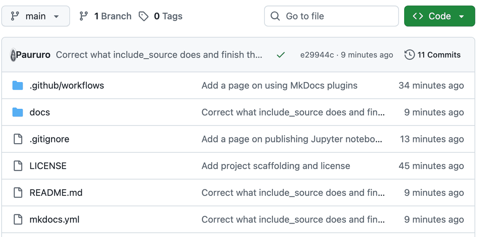

# 7. Put it on GitHub

Your site works on your computer. To put it on the internet it first has to
live on GitHub. This page assumes you have never used GitHub before.

## What GitHub actually is

GitHub is a website where folders of files are stored, with a complete history
of every change ever made to them.

Three words explain most of it:

**Repository.** A project folder stored on GitHub. Yours will hold `docs`,
`mkdocs.yml` and a couple of small configuration files. People say "repo".

**Commit.** One saved change, with a short message describing it. Not a
backup of everything: a record of what changed, when, and why. You can look at
any past commit and go back to it.

**Push.** Sending commits from your computer up to GitHub. Until you push,
your changes exist only on your machine.

There is a fourth reason this matters here: GitHub can host your website for
free. That is what [step 8](publish.md) uses.

## Create your account

1. Go to [github.com/signup](https://github.com/signup).
2. Enter an email, a password and a username. The username becomes part of your
   web address, so `maria-lopez` reads better than `xXcoolcatXx`.
3. Confirm your email.
4. Choose the free plan. It includes everything in this tutorial.

## Create the repository


1. Once logged in, click the **+** in the top right corner, then
   **New repository**.
2. **Repository name:** `my-docs`. Lowercase, no spaces, hyphens instead.
3. **Description:** one line saying what it is. Optional.
4. Choose **Public**. Free website hosting requires it, and it means anyone can
   read your documentation, which is normally the point.
5. Leave **Add a README file** unticked, along with the other two dropdowns.
   Your folder already has files, and starting empty avoids a conflict.
6. Click **Create repository**.

You land on a page full of commands. Ignore it for a moment and pick one of the
two routes below.

## Two ways to upload your files

=== "Route A: the browser (no commands)"

    Best if you would rather not touch the terminal again.

    1. On your new repository page, click **uploading an existing file**, in
       the line "or upload an existing file".
    2. Open your `my-docs` folder in your file manager.
    3. Drag `mkdocs.yml` and the whole `docs` folder onto the browser window.
       Wait for the upload to finish.
    4. At the bottom, in the box under **Commit changes**, write
       `Add documentation site`.
    5. Click **Commit changes**.

    Your files are on GitHub. That was a commit and a push in one step.

    To change something later: click the file on GitHub, click the pencil icon,
    edit, then **Commit changes**. To add a page: **Add file** then
    **Create new file**.

    !!! warning "Do not upload the `site` folder"
        It is generated, it is large, and GitHub will build it for you. Only
        `docs`, `mkdocs.yml` and the small configuration files belong here.

=== "Route B: git (the standard way)"

    A few more minutes now, much faster afterwards.

    **Install git**

    - **Windows:** download it from [git-scm.com](https://git-scm.com/downloads)
      and accept every default in the installer.
    - **macOS:** run `git --version`. If git is missing, macOS offers to
      install it. Accept.
    - **Linux:** `sudo apt install git` or `sudo dnf install git`.

    **Tell git who you are.** Once per computer, using the same email as your
    GitHub account:

    ```bash
    git config --global user.name "Your Name"
    git config --global user.email "you@example.com"
    ```

    **Send your folder to GitHub.** From inside `my-docs`:

    ```bash
    git init
    git add .
    git commit -m "Add documentation site"
    git branch -M main
    git remote add origin https://github.com/your-username/my-docs.git
    git push -u origin main
    ```

    Replace `your-username` with yours. GitHub asks you to log in through your
    browser the first time.

    Refresh the repository page and your files are there.

    **What those commands did**

    | Command | In plain words |
    | --- | --- |
    | `git init` | Start tracking changes in this folder |
    | `git add .` | Mark everything as ready to be saved |
    | `git commit -m "..."` | Save it, with that message |
    | `git branch -M main` | Call the main line of work `main` |
    | `git remote add origin ...` | Remember which GitHub repository this belongs to |
    | `git push -u origin main` | Upload it |

    You only run the first five once. From then on, every update is three
    lines:

    ```bash
    git add .
    git commit -m "Describe what changed"
    git push
    ```

## Keep the `site` folder out

If you took route B, add a file called `.gitignore` next to `mkdocs.yml`, with
this inside:

```text title=".gitignore"
site/
.venv/
__pycache__/
.DS_Store
```

Anything listed there is ignored by git, so it never gets uploaded. This is
what stops thousands of generated files from ending up in your repository.

Created it after your first commit? Run this once to clear what already slipped
in:

```bash
git rm -r --cached site
git commit -m "Stop tracking the generated site folder"
git push
```

## What your repository should contain

```text
my-docs/
├── .gitignore
├── mkdocs.yml
└── docs/
    ├── index.md
    └── install.md
```

Small, readable, all text. That is exactly right.

On GitHub it looks like this, which is the repository for this very tutorial:



Each row is a file or folder, with the message from the last commit that
touched it. If yours looks roughly like that, you are done here.

## If something goes wrong

??? failure "`Support for password authentication was removed`"
    GitHub no longer accepts your account password on the command line. Install
    the [GitHub CLI](https://cli.github.com/) and run `gh auth login`, which
    logs you in through the browser and configures git for you. Alternatively,
    create a personal access token under
    **Settings > Developer settings > Personal access tokens** and use it in
    place of the password.

??? failure "`remote origin already exists`"
    You ran `git remote add origin` twice. Point it at the right place instead:

    ```bash
    git remote set-url origin https://github.com/your-username/my-docs.git
    ```

??? failure "`failed to push some refs`"
    GitHub has something your computer does not, usually because you ticked
    "Add a README file" when creating the repository. Bring it down first:

    ```bash
    git pull --rebase origin main
    git push -u origin main
    ```

---

Next: [publish it online](publish.md).
