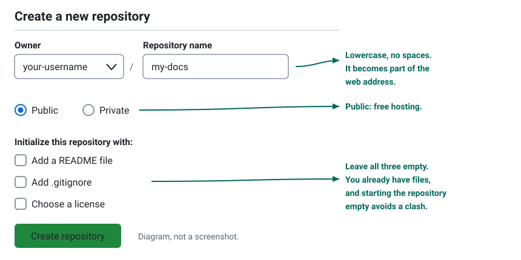
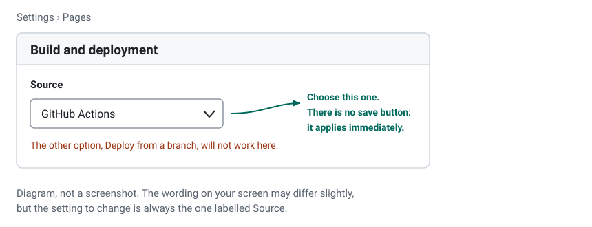
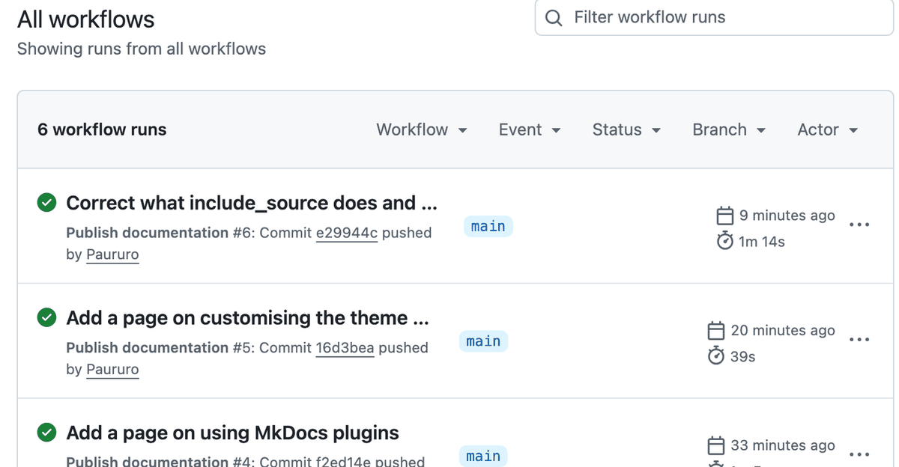

# Shortcut: publish without installing anything

Everything in this tutorial can be done from a web browser. No Python, no
terminal, no commands. You create four small files by typing them into GitHub,
and GitHub builds and publishes the site for you.

It takes about fifteen minutes and the result is a real, live website.

!!! question "Should I do this or the full tutorial?"
    Do this if the word "terminal" is where you were about to give up, or if
    you want something online today and the details later.

    The one thing you lose is the live preview: instead of seeing your changes
    instantly on your own screen, you save a file and wait about a minute for
    the website to catch up. That is fine for a handful of pages and tiring
    for fifty.

    Nothing here is wasted work. When you want the preview, do
    [step 2](install.md) and carry on with the same repository.

## 1. Create a GitHub account

Go to [github.com/signup](https://github.com/signup), enter an email, a
password and a username, and confirm the email. The free plan includes
everything used here.

Your username becomes part of your web address, so pick something you will not
mind reading out loud.

## 2. Create the repository

Click the **+** in the top right corner, then **New repository**.



Fill it in like the diagram, with one deliberate difference: **tick
Add a README file**. It gives the repository a first file, which puts you
straight into the normal view with an **Add file** button instead of a page of
commands.

Then click **Create repository**.

!!! note "Step 7 says the opposite, on purpose"
    [Step 7](github-basics.md) tells you to leave that box unticked, because
    there you already have files on your computer and an empty repository
    avoids a clash. Here you have nothing yet, so the README is helpful.

## 3. Turn on GitHub Pages now, before the files

Click **Settings**, then **Pages** in the left sidebar, and set **Source** to
**GitHub Actions**.



Doing this first means that when the last file lands, everything simply works.
Leave it until later and your first attempt fails for no good reason.

## 4. Add the four files

For each one: click **Add file**, then **Create new file**, type the file name
exactly as given, paste the contents, and click **Commit changes** at the
bottom.

!!! tip "Typing a `/` in the file name creates folders"
    There is no button for making a folder. Typing `docs/index.md` as the name
    creates the `docs` folder and the file inside it, in one go.

### File 1 of 4: `docs/index.md`

This is your home page. Change the words to your own.

```markdown title="docs/index.md"
# My project

Welcome. This site explains what this project is and how to use it.

## What it does

Write whatever you like here. This is ordinary text.

## Getting started

1. The first thing to do.
2. The second thing.
3. The third thing.
```

### File 2 of 4: `mkdocs.yml`

The settings. Change `site_name` and, in `site_url`, replace `your-username`
with yours and `my-docs` with your repository name.

```yaml title="mkdocs.yml"
site_name: My project
site_url: https://your-username.github.io/my-docs/

theme:
  name: material
  palette:
    - media: "(prefers-color-scheme: light)"
      scheme: default
      primary: teal
      toggle:
        icon: material/weather-night
        name: Switch to dark mode
    - media: "(prefers-color-scheme: dark)"
      scheme: slate
      primary: teal
      toggle:
        icon: material/weather-sunny
        name: Switch to light mode
  features:
    - content.code.copy
    - navigation.top

markdown_extensions:
  - admonition
  - attr_list
  - tables
  - toc:
      permalink: true
  - pymdownx.details
  - pymdownx.superfences

nav:
  - Home: index.md
```

### File 3 of 4: `requirements.txt`

Which versions GitHub should install. Copy it exactly.

```text title="requirements.txt"
mkdocs==1.6.1
mkdocs-material==9.7.7
```

### File 4 of 4: `.github/workflows/deploy.yml`

Save this one last. It is the instruction sheet GitHub follows, and adding it
is what starts the first build.

```yaml title=".github/workflows/deploy.yml"
name: Publish documentation

on:
  push:
    branches:
      - main
  workflow_dispatch:

permissions:
  contents: read
  pages: write
  id-token: write

concurrency:
  group: pages
  cancel-in-progress: false

jobs:
  build:
    runs-on: ubuntu-latest
    steps:
      - uses: actions/checkout@v7
      - uses: actions/setup-python@v7
        with:
          python-version: "3.12"
          cache: pip
      - run: pip install -r requirements.txt
      - run: mkdocs build --strict
      - uses: actions/configure-pages@v6
      - uses: actions/upload-pages-artifact@v5
        with:
          path: site

  deploy:
    needs: build
    runs-on: ubuntu-latest
    environment:
      name: github-pages
      url: ${{ steps.deployment.outputs.page_url }}
    steps:
      - id: deployment
        uses: actions/deploy-pages@v5
```

Copy it exactly, indentation included. This is the one file where a stray space
matters.

## 5. Watch it build

Click the **Actions** tab. A run appears with a yellow dot and turns into a
green tick after a minute or so.



A red cross instead? Click the run, then the failed step, and read the last few
lines. The cause is nearly always one of two things: `Source` is not set to
**GitHub Actions**, or `deploy.yml` lost its indentation on the way in. The
[Troubleshooting](troubleshooting.md) page has the rest.

## 6. Open your website

Go back to **Settings > Pages**. Your address is at the top:

```text
https://your-username.github.io/my-docs/
```

That link works for anyone, anywhere.

## Changing it later

1. Open the repository and click the file you want to change.
2. Click the pencil icon in the top right of the file.
3. Edit, then click **Commit changes**.
4. Wait about a minute. The site updates itself.

To add a page: **Add file > Create new file**, name it something like
`docs/guide.md`, write it, commit. Then edit `mkdocs.yml` and add it to `nav`:

```yaml title="mkdocs.yml"
nav:
  - Home: index.md
  - Guide: guide.md
```

The `nav` paths start inside `docs`, so it is `guide.md` and not
`docs/guide.md`.

!!! success "Before you move on"
    - Your repository contains four files: `docs/index.md`, `mkdocs.yml`,
      `requirements.txt` and `.github/workflows/deploy.yml`.
    - **Settings > Pages > Source** says **GitHub Actions**.
    - The Actions tab shows a green tick.
    - Your `github.io` address opens your site.

    If the address 404s while the tick is green, it is almost always the Source
    setting. Check that one first.

## What to read next

You now have the same thing the full tutorial builds, so any page here applies
to your site:

* [4. Write your pages](writing-pages.md) for the Markdown you will use daily.
* [6. Make it look good](theme.md) for colours, a logo and dark mode.
* [2. Install the tools](install.md) when you get tired of waiting a minute to
  see each change.
